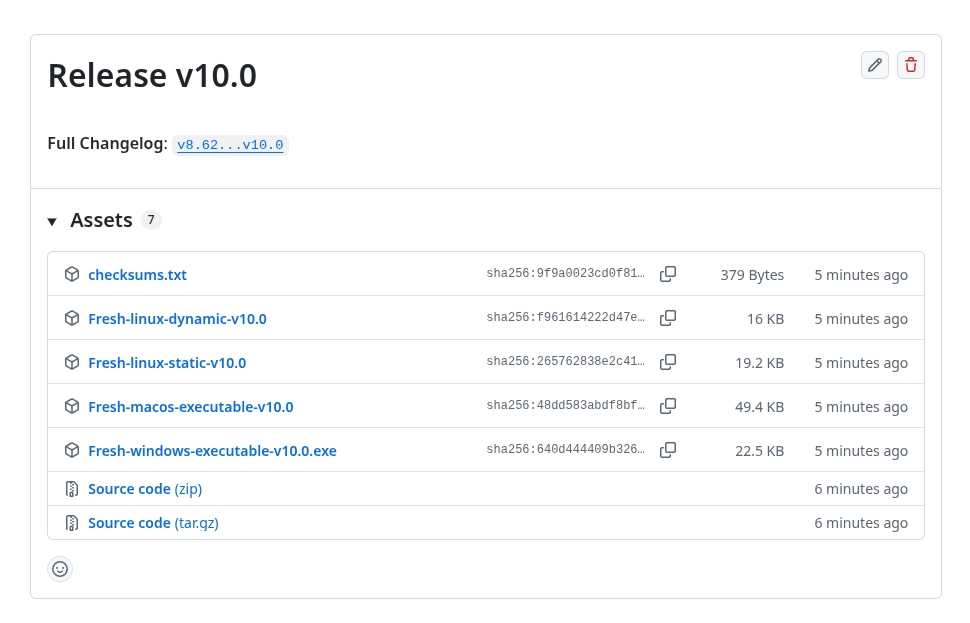

---

Визуализация сравнение размеров исполняемого файла для разных слоёв:

Реальность такова **1** `Musl Static` 2 `Gcc Linux` 3 `Mac/Windows` - закрывает многие споры разом.

Поясню: 1 самодостаточность 2 минимальный размер но необходимость иметь ось в фоне 3 избыточность особенно `Mac` но там по сути в базе `Unix Way` а значит всё не плохо, а вот `Windows` там в принципе бардак ибо пока используя терминал для демонстрации возможностей идей проекта обнаружил, что при передаче местоположения мыши в программу ограничения наложенные на стандарт со стороны API Windows - по X `0-90`, в частности для иных участников соревнования по X `0-222` - этот момент говорит только об одном, что эта система огромный костыль сама собой. Для ярых защитников этой поделки и знатоков `Mouse X11 SGR` - тоже костыль, полное игнорирование ansi последовательностей `попытка создать на заре интернета html подобный api` не жизнеспособен.

Событийная модель создана, событий [K_NO,  K_Ctrl_A, K_Ctrl_B, ... ,K_ALT_ENT, {K_Mouse...255}], причём событие K_NO - постоянное {на каждой итерации основного цикла}, а остальные происходят по мере поступления с клавиатуры или от мыши {при выборе пункта меню ...}. Интервал {K_Mouse ... 255} событий которые не могут прилететь с клавиатуры можно легко использовать внутри для упрощение реализации чего либо.

По сути получается очень не обычная система настоящего времени в принципе, так как динамические окна не ограничены изначально то появляются интересные возможности связанные с моим изначальным подходом к распределению холста и единственное ограничение которое я обязан реализовать - если создано более одного такого окна то пока динамическое окно наполняется данными, а значит границы буферов строк плавают и создают неопределённость при наполнении следующего подобного окна - будет блокировка пока процесс заливки данных в динамическое окно не будет завершён. Что это даст - самый просто пример загрузить разом несколько файлов имея их всегда под рукой в одном пространстве причём копирование из одного в другой тривиальная задача, думаю смогу решить момент с аккумулированием нулевых событий хотя возникнут коллизии из за общей клавы/мыши и событийного вектора - в общем попробую, а там увидим.

Добавил диалог с deepseek в папку о сути поэкта (для тех кто умеет читать но не понимает код). Теперь, когда достал из структуры всё, осознал ДНК, и сделал удобную обёртку пора писать WinData и Render. 

Неделя потеряна в Департаменте (а по сути руководство "Работа России" в нашем регионе), ну ничего всё равно допишу проект!

Неделя потеряна в ЦЗН Томска, но я вернулся - теперь математика в норме, пришлось реально замедлять перемещения вьюпорта при `+ctrl` а то слишком быстро - теперь прыгаем пространствами учитывая ускорение.

## Вьюпорт мышь клавиатура изменение размеров и масштаба.
`keyboard` `up`,`down`,`left`,`rigth` `mouse` `button mouse`,`roll mouse`,`+shift roll mouse`,`+ctrl roll mouse`

<video src="https://github.com/user-attachments/assets/231a6004-a684-45f1-87d9-8ce4f11437bc" controls width="600"></video>

**Fresh** — это первая **среда исполнения приложений (Runtime Environment)**, полностью независимая от ОС, процессора, видеокарты и внешних библиотек. Это не фреймворк и не библиотека. Это **новой слой реальности** между данными и наблюдателем.

Одно приложение, собранное с Fresh, работает **одинаково** на Linux, macOS, Windows, в Docker, по SSH и на встраиваемых системах. Без доработок. Без рантаймов. Без виртуализации.

**Один статический бинарник (19 КБ)** — и ваш софт работает **везде и навсегда**.

---

## Проблема, которую вы замечали, но не могли сформулировать

Современная разработка требует:
- Выбрать ОС (и страдать от её ограничений)
- Выбрать фреймворк (Qt, GTK, Electron...)
- Тащить за собой мегабайты зависимостей
- Переписывать под каждую платформу
- Молиться, чтобы API не устарел через год

**Fresh доказывает: всё это не нужно.**

---

## Что внутри 19 КБ?

- **Графика 16K** — Весь мир{UTF8[Браэль-символы]}/Структуры ячеек  = **16K × 16K** точек[Браэль-символы] без видеокарты.

  ⚡ **Хотите больше?**
  Поменяйте константу `13` → `14` получите **32K × 32K** → ...
  (32K монитор с запасом в несколько полных экранов и 512 окнами).

- **Оконная система** — Z-порядок, иерархия, перекрытия, скроллинг
- **Реальный ввод** — Клава, мышь (X10), горизонт. скролл через Shift, RT-обработка
- **Навигация** — Вьюпорт с 3 режимами, адаптивное ускорение
- **Нулевые зависимости** — Никаких библиотек — только чистый C и системные вызовы
- **Архитектурная свобода** — Код сам подстраивается под 32/64/128... бит через абстракцию Cell

---

## Мышь из 1995-го против «инноваций» 2026-го

Современные мыши продают с «премиальным» горизонтальным скроллом. Fresh даёт его **любой** мыши через Shift + колесо. Без драйверов, без новых устройств.

- 96/97 — вертикаль
- 100/101 — горизонталь (Shift)
- 112/113 — зум (Ctrl)

**Четыре кода — и мышь любого года выпуска получает возможности, которые маркетологи называют «прорывом».**

---

## Производительность как вызов

Fresh не просто быстр — он **обходит ограничения железа**:

- Не нужна видеокарта (графика через шрифт терминала)
- Не нужен X11/Wayland (прямой вывод в терминал для демонстрации)
- Не нужен GPU для рендеринга (CPU + RDTSC + умный кэш)
- **Бинарник 16 КБ** добирает после запуска 265Мбайт для 16к и 32к мониторов!

На одном ядре, в текстовой консоли, по SSH — FPS ограничен только скоростью вашего терминала.

---

## Для кого Fresh?

- **Системные программисты** — создавайте утилиты с GUI, которые работают на сервере без GPU
- **Игроделы** — пишите ретро-игры с графикой 16K, которые запускаются даже на калькуляторе
- **Встраиваемщики** — получите полноценный интерфейс на устройстве без framebuffer
- **Все, кто устал от «докера, npm, сборки 10 минут, а оно не работает»**

---

## Сборка — это копирование одного файла
git clone https://github.com/AVPscan/Fresh
cd Fresh
make
./fresh

---
Вас встречает **пустое пространство** и вьюпорт. Данных пока нет — но вы уже можете:
- Двигаться (стрелки, Ctrl+стрелки — ускорение)
- Приближаться/отдаляться (F3/F4)
- Создавать окна (вызов Window())
- Взаимодействовать с мышью

**Рендер данных и _WData — единственное, что ещё не дописано.** Но архитектура готова.

---

## Что внутри репозитория

- `sys.h` — магия абстракции: цвета, макросы, структуры
- `engine.c` — сердце движка: VRAM, вьюпорт, события
- `sys_linux.c` / `sys_macos.c` / `sys_windows.c` — минимальные системные прослойки
- `IIAbout/` — почитать

---

## Один человек против индустрии

Описание в папке проекта **IIAbout**

Это СПО и один человек без начальства, без грантов, без «экосистем». Только код, который работает.

> «Вам больше не нужно знать GTK, Qt и прочие слои в ОС. А если вы не программировали — прочитайте книгу и сэкономите годы в вузе.»

---

## Лицензия

**GPLv3** — свобода использовать, изменять, распространять.
Но главная свобода — **не зависеть от производителей ОС, процессоров и стран**.

---

## Если вы это поняли — поставьте звезду

Fresh не нуждается в рекламе. Он нуждается в тех, кто готов **перестать строить софт из кирпичей фреймворков** и начать создавать **вечные, переносимые, честные программы**.

**Fresh — GitHub:** https://github.com/AVPscan/Fresh

---

*P.S. Да, это всё работает даже по SSH. Да, на Raspberry Pi. Да, на 32-битном процессоре. Да, без видеокарты. Нет, это не магия. Это просто C и 35 лет правильного опыта.*

